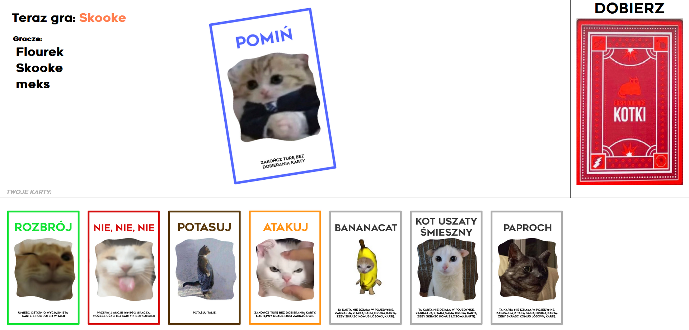
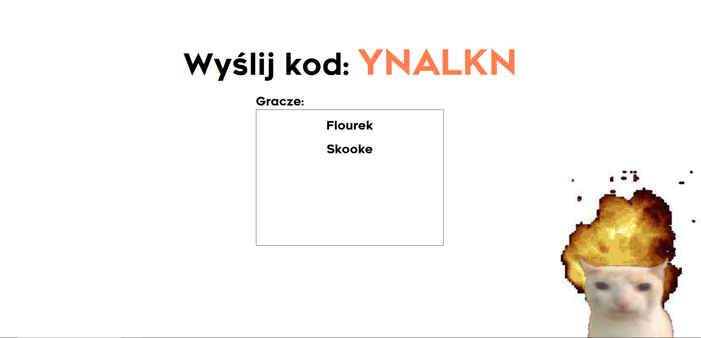

# Exploding-Kittens
Flask and Socket-IO card game made after the popular game "Exploding Kittens". The game is only available in Polish, as it was made for an university assignment.

# The Game


# Lobby
After creating a room, share the room code with your friends so they can join.



# Running the project
```
pip install -r requirements.txt
flask run.py
```


This project isn't affiliated in any way with Exploding Kittens Inc. Please don't sue me
